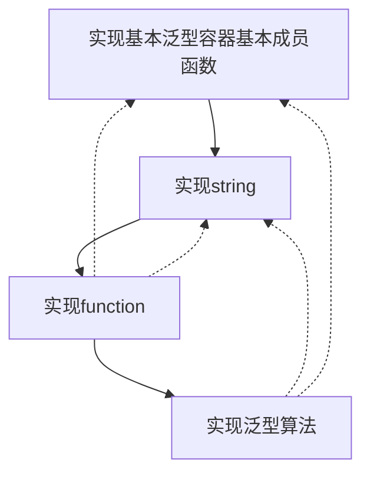
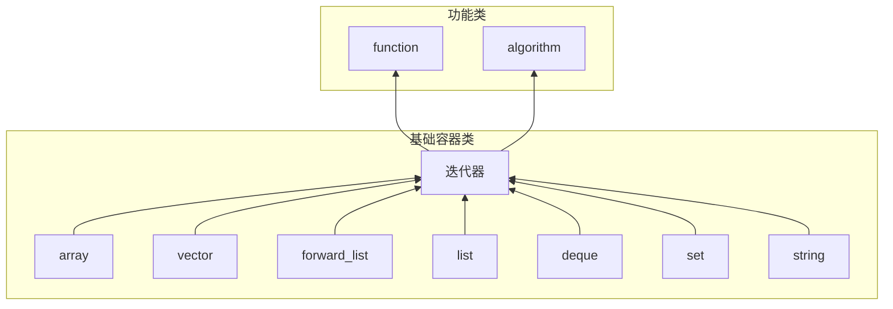

# MiniSTL概要设计说明书
## 1.简介
* 使用C++语言实现C++标准模板库STL中的基本泛型容器以及泛型算法等。

## 2.总体设计
### 2.1. 需求规定
* 实现基本泛型容器array,vector,forward_list,list,deque,set,map,unordered_set,unordered_map;实现string,function,泛型算法;
* 要求:
    + 增删查改等成员方法
    + 构造、析构函数
    + 拷贝构造、拷贝赋值
    + 移动构造、移动赋值
    + 强异常保证安全
    + iterator
    + public成员方法的单元测试
    + 无需支持allocator
+ 参考: 《STL源码解析》 cppreference

+ STL中所有的函数默认均按照C++11标准，不再实现C++20标准中移除的部分函数。在C++11标准后被替代移除的函数实现最新替代版本。

### 2.2. 运行环境
|名称   |  属性|
|------|-----|
| 语言  | C++11 |
|操作系统|Ubuntu 20.04|
|编译器| g++|

### 2.3. 基本设计概念和处理流程
首先实现基本泛型容器的基本设计，包括类成员变量，类成员函数等。  
实现string。  
然后实现function。  
最后实现泛型算法。  
执行单元测试。  
在每一步的设计与实现中完善之前部分对于现行部分的依赖部分的设计实现。

完善与修改:
+ 对命名空间的管理和修改  
+ 实现更多算法  
+ 改进内存管理  
+ 实现异常安全保证  
+ 进行性能优化  

使用敏捷开发，利用MiniSTL这个项目的特点：
+ 个人项目-能够覆盖开发的各个方面
+ MiniSTL中的各个模块相对独立-耦合性很低，迭代成本较小可以快速适应项目的变化以及增量交付

格式控制：
clang-format

### 2.4. 软件体系结构

## 3.MiniSTL子系统(模块)设计
### 3.1.基础容器类
实现相应类的构造函数、析构函数、拷贝构造函数、拷贝赋值函数、移动构造函数、移动赋值函数、成员函数。

### 3.2.迭代器
实现相应类的迭代器，封装内部实现细节，对外保持使用方式统一。

### 3.3.function
实现function中的函数、仿函数。

### 3.4. algorithm
实现算法中的函数部分，通过迭代器统一访问不同类。

## 4.接口设计
### 4.1.用户接口
用户通过包含相应类的头文件来使用MiniSTL中的类及其public成员函数。因为类的名称以及成员函数的命名完全与STL中相应的容器或者函数名称相同，所以使用同STL，只是包括的头文件名称稍有差别。
头文件如下:
|名称|头文件名称|
|-------|:-----|
|array|MiniArray.h|
|vector|MiniVector.h|
|forward_list|MiniForwardList.h|
|list|MiniList.h|
|deque|MiniDeque.h|
|set|MiniSet.h|
|map|MiniMap.h|
|unordered_set|MiniUnorderedSet.h|
|unordered_map|MiniUnorderedMap.h|
|string|MiniString|
|function|MiniFunctional|
|algorithm|MiniAlgorithm|

## 5.安全性设计
### 5.1. RAII原则
类中内存资源的申请遵从RAII准则(Resource Acquisition Is Initialization),将资源的生命周期与对象的生命周期绑定在一起，‌从而提高程序的安全性和效率。‌

### 5.2. 封装数据结构
只为用户提供类的public接口，将其他实现部分封装起来防止错误调用。

### 5.3. 强异常安全保证
实现强异常安全保证，使得程序在发生异常的情况下，程序的状态不会改变，并且不会泄漏资源。
+ RAII
+ 提供异常安全的迭代器
+ 提供异常安全的容器操作

## 6.可测试性设计
使用GoogleTest进行类的成员方法的单元测试

