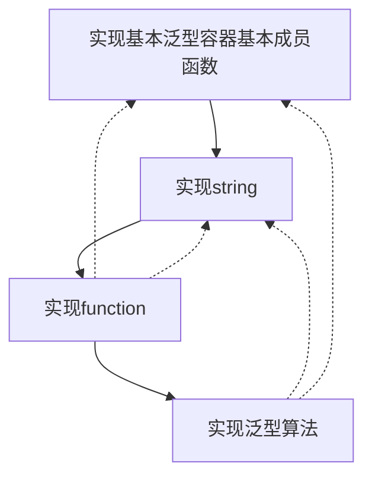
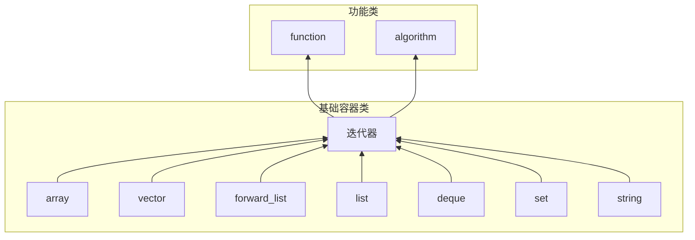

# MiniSTL概要设计说明书
## 1.简介
* 使用C++语言实现C++标准模板库STL中的基本泛型容器以及泛型算法等。

## 2.总体设计
### 2.1. 需求规定
* 实现基本泛型容器array,vector,forward_list,list,deque,set,map,unordered_set,unordered_map;实现string,function,泛型算法;
* 要求:
    + 增删查改等成员方法
    + 构造、析构函数
    + 拷贝构造、拷贝赋值
    + 移动构造、移动赋值
    + 强异常保证安全
    + iterator
    + public成员方法的单元测试
    + 无需支持allocator
+ 参考: 《STL源码解析》 cppreference

+ STL中所有的函数默认均按照C++11标准，不再实现C++20标准中移除的部分函数。在C++11标准后被替代移除的函数实现最新替代版本。

### 2.2. 运行环境
|名称   |  属性|
|------|-----|
| 语言  | C++11 |
|操作系统|Ubuntu 20.04|
|编译器| g++|

### 2.3. 基本设计概念和处理流程
#### 2.3.1. 基本设计理念
设计每一个容器时考虑一下几个方面
+ 模板化以支持多种类型
+ 底层数据结构
+ 安全的元素访问
+ 初始化和构造
+ 迭代器支持
+ 元素访问和容量查询
+ 操作和修改
+ 异常安全

完善与修改:
+ 对命名空间的管理和修改  
+ 实现更多算法  
+ 改进内存管理  
+ 实现异常安全保证  
+ 进行性能优化  

使用敏捷开发，利用MiniSTL这个项目的特点：
+ 个人项目-能够覆盖开发的各个方面
+ MiniSTL中的各个模块相对独立-耦合性很低，迭代成本较小可以快速适应项目的变化以及增量交付

格式控制：
clang-format

### 2.4. 软件体系结构

## 3.MiniSTL子系统(模块)设计
### 3.1.基础容器类
实现相应类的构造函数、析构函数、拷贝构造函数、拷贝赋值函数、移动构造函数、移动赋值函数、成员函数。

#### 3.1.1. Array
##### 3.1.1.1.模板化以支持多种类型
+ 提供array类的泛化性与复用性
##### 3.1.1.2.以固定大小的数组作为该容器的底层数据结构
+ 在编译时确定大小，有助于优化性能，不需要动态内存分配。
##### 3.1.1.3.安全的元素访问
+ 通过提供at成员函数，array类允许进行越界检查的元素访问，与operator[]相比，它更加安全。
##### 3.1.1.4.初始化和构造
+ array类提供了多种构造函数，包括默认构造函数、拷贝构造函数、移动构造函数和初始化列表构造函数，以支持不同的初始化需求。
##### 3.1.1.5.迭代器支持
+ 类中定义了迭代器类型，允许使用标准库算法和范围for循环来遍历数组元素。
##### 3.1.1.6.元素访问和容量查询
+ 提供了front、back、data等成员函数，以方便地访问数组的第一个和最后一个元素以及底层数据。同时，size和empty成员函数提供了数组的容量信息。
##### 3.1.1.7.操作和修改
+ fill函数允许用单一值填充整个数组，而swap函数允许两个相同大小的数组交换内容，这些操作不抛出异常，保证效率。
##### 3.1.1.8.异常安全
+ 在可能发生错误的情况下，如越界访问，类会抛出异常（如std::out_of_range），确保了异常安全性。

#### 3.1.2.froward_list
##### 3.1.2.1.模板化以支持多种类型
+ 提供forward_list类的泛化性与复用性
##### 3.1.2.2.以单链表结构作为该容器的底层数据结构
+ 使用自定义的node结构来存储链表的节点，每个节点包含一个值和一个指向下一个节点的指针。
##### 3.1.2.3.迭代器支持
+ 提供前向迭代器
##### 3.1.2.4.容量和大小查询
+ 提供了max_size、empty和size函数，以获取链表的最大容量、判断链表是否为空以及获取链表中元素的数量。
##### 3.1.2.5.内存管理
+ release函数用于释放链表占用的内存，确保了链表的内存是安全的。
##### 3.1.2.6.构造和析构函数
+ 提供了多种构造函数，包括默认构造函数、列表初始化构造函数、拷贝构造函数、移动构造函数和析构函数，以支持不同的初始化需求和释放资源。
##### 3.1.2.7.异常安全
+ 在可能发生错误的情况下，如空链表操作，类会抛出异常（如std::out_of_range），确保了异常安全性。
##### 3.1.2.8.增删查改
+ 提供了front、back、insert_after、erase_after等成员函数，以方便地访问和修改链表中的元素以及提供swap、resize、merge、unique等操作函数，以支持链表的基本操作。

#### 3.1.3.list
##### 3.1.3.1.模板化以支持多种类型
+ 提供list类的泛化性与复用性。
##### 3.1.3.2.以双向链表结构作为该容器的底层数据结构
+ 使用自定义的node结构来存储链表的节点，每个节点包含一个值、前一个节点和后一个节点的指针。
##### 3.1.3.3.模迭代器支持
+ 提供双向迭代器，允许使用标准库算法和范围for循环来遍历链表元素。
##### 3.1.3.4.容量和大小查询
+ 提供了empty、size和max_size函数，以获取链表是否为空、链表中元素的数量以及链表的最大容量。
##### 3.1.3.5.内存管理
+ release函数用于释放链表占用的内存，确保了链表的内存是安全的。
##### 3.1.3.6.构造和析构函数
+ 提供了多种构造函数，包括默认构造函数、列表初始化构造函数、拷贝构造函数、移动构造函数和析构函数，以支持不同的初始化需求和释放资源。
##### 3.1.3.7.异常安全
+ 在可能发生错误的情况下，如空链表操作，类会抛出异常（如std::out_of_range），确保了异常安全性。

#### 3.1.4.vector
##### 3.1.4.1.模板化以支持多种类型
+ 提供vector类的泛化性与复用性。
##### 3.1.4.2.以动态数组作为该容器的底层数据结构
+ 使用动态数组new进行内存管理，可以根据需要动态地分配和释放内存。
##### 3.1.4.3.迭代器支持
+ 提供vector类的随机访问迭代器。
##### 3.1.4.4.容量和大小查询
+ 提供了size、capacity和empty函数，以获取数组中元素的数量、数组容量以及判断数组是否为空。
##### 3.1.4.5.内存管理
+ release函数用于释放数组占用的内存，确保了数组的内存是安全的。
##### 3.1.4.6.构造和析构函数
+ 提供了多种构造函数，包括默认构造函数、列表初始化构造函数、拷贝构造函数、移动构造函数和析构函数，以支持不同的初始化需求和释放资源。
##### 3.1.4.7.操作模块
+ 提供了reserve、fill_initialize、push_back、pop_back、erase、insert等操作函数，以支持数组的基本操作。
##### 3.1.4.8.异常安全
+ 在可能发生错误的情况下，如空数组操作，类会抛出异常（如std::out_of_range），确保了异常安全性。

#### 3.1.5.deque
##### 3.1.5.1.模板化以支持多种类型
+ 提供deque类的泛化性与复用性。
##### 3.1.5.2.以map中央控制器+固定长度buffer作为该容器的底层数据结构
+ 使用map中央控制器中指向多个固定长度的buffer作为该容器的存储结构。
+ buffer中存储数据，而map用于管理全部buffer。
##### 3.1.5.3.迭代器支持
+ 提供deque类的随机访问迭代器。
##### 3.1.5.4.容量和大小查询
+ 提供了size和empty函数，以获取中队列中元素的数量和判断队列是否为空。
##### 3.1.5.5.内存管理
+ release函数用于释放队列占用的内存，确保了队列的内存是安全的。
##### 3.1.5.6.构造和析构函数
+ 提供了多种构造函数，包括默认构造函数、列表初始化构造函数、拷贝构造函数、移动构造函数和析构函数，以支持不同的初始化需求和释放资源。
##### 3.1.5.7.操作模块
+ 提供了push_back、pop_back、push_front、pop_front、insert、erase等操作函数，以支持双向队列的基本操作。
##### 3.1.5.8.异常安全
+ 在可能发生错误的情况下，如空数组操作，类会抛出异常（如std::out_of_range），确保了异常安全性。
##### 3.1.5.9.性能优化
+ 通过动态分配内存，队列可以根据需要进行扩展和收缩，提高了性能。

#### 3.1.5.set
##### 3.1.5.1.模板化以支持多种类型
+ 提供set类的泛化性与复用性。
##### 3.1.5.2.使用红黑树(RB_Tree)作为该容器的底层数据结构
+ set内部维护一个RB_Tree储存数据
##### 3.1.5.3.迭代器支持
+ 提供set类的双向迭代器。
##### 3.1.5.4.容量和大小查询
+ 提供了size和empty函数，以获取中集合中元素的数量和判断是否为空。
##### 3.1.5.5.内存管理
+ release函数用于释放set占用的内存，确保了内存是安全的。
##### 3.1.5.6.构造和析构函数
+ 提供了多种构造函数，包括默认构造函数、列表初始化构造函数、拷贝构造函数、移动构造函数和析构函数，以支持不同的初始化需求和释放资源。
##### 3.1.5.7.操作模块
+ 提供了insert、erase等操作函数，以支持集合的基本操作。
##### 3.1.5.8.异常安全
+ 在可能发生错误的情况下，类会抛出异常（如std::out_of_range），确保了异常安全性。

#### 3.1.5.map
##### 3.1.5.1.模板化以支持多种类型
+ 提供map类的泛化性与复用性。
##### 3.1.5.2.使用红黑树(RB_Tree)作为该容器的底层数据结构
+ map内部维护一个RB_Tree储存数据
##### 3.1.5.3.迭代器支持
+ 提供map类的双向迭代器。
##### 3.1.5.4.容量和大小查询
+ 提供了size和empty函数，以获取映射中元素的数量和判断是否为空。
##### 3.1.5.5.内存管理
+ release函数用于释放占用的内存，确保了内存是安全的。
##### 3.1.5.6.构造和析构函数
+ 提供了多种构造函数，包括默认构造函数、列表初始化构造函数、拷贝构造函数、移动构造函数和析构函数，以支持不同的初始化需求和释放资源。
##### 3.1.5.7.操作模块
+ 提供了insert、erase等操作函数，以支持集合的基本操作。
##### 3.1.5.8.异常安全
+ 在可能发生错误的情况下，类会抛出异常（如std::out_of_range），确保了异常安全性。

#### 3.1.5.unordered_set
##### 3.1.5.1.模板化以支持多种类型
+ 提供unordered_set类的泛化性与复用性。
##### 3.1.5.2.使用哈希表(HashTable)作为该容器的底层数据结构
##### 3.1.5.3.迭代器支持
+ 提供unordered_set类的前向迭代器。
##### 3.1.5.4.容量和大小查询
+ 提供了size和empty函数，以获取中unordered_set中元素的数量和判断是否为空。
##### 3.1.5.5.内存管理
+ release函数用于释放占用的内存，确保了内存是安全的。
##### 3.1.5.6.构造和析构函数
+ 提供了多种构造函数，包括默认构造函数、列表初始化构造函数、拷贝构造函数、移动构造函数和析构函数，以支持不同的初始化需求和释放资源。
##### 3.1.5.7.操作模块
+ 提供了insert、erase等操作函数，以支持unordered_set的基本操作。
##### 3.1.5.8.异常安全
+ 在可能发生错误的情况下，类会抛出异常（如std::out_of_range），确保了异常安全性。

#### 3.1.5.unordered_map
##### 3.1.5.1.模板化以支持多种类型
+ 提供unordered_map类的泛化性与复用性。
##### 3.1.5.2.使用哈希表(HashTable)作为该容器的底层数据结构
##### 3.1.5.3.迭代器支持
+ 提供unordered_map类的前向迭代器。
##### 3.1.5.4.容量和大小查询
+ 提供了size和empty函数，以获取中unordered_map中元素的数量和判断是否为空。
##### 3.1.5.5.内存管理
+ release函数用于释放占用的内存，确保了内存是安全的。
##### 3.1.5.6.构造和析构函数
+ 提供了多种构造函数，包括默认构造函数、列表初始化构造函数、拷贝构造函数、移动构造函数和析构函数，以支持不同的初始化需求和释放资源。
##### 3.1.5.7.操作模块
+ 提供了insert、erase等操作函数，以支持unordered_map的基本操作。
##### 3.1.5.8.异常安全
+ 在可能发生错误的情况下，类会抛出异常（如std::out_of_range），确保了异常安全性。
### 3.2.迭代器
实现相应类的迭代器，封装内部实现细节，对外保持使用方式统一。

### 3.3.function
实现function中的函数、仿函数。

### 3.4. algorithm
实现算法中的函数部分，通过迭代器统一访问不同类。

## 4.接口设计
### 4.1.用户接口
用户通过包含相应类的头文件来使用MiniSTL中的类及其public成员函数。因为类的名称以及成员函数的命名完全与STL中相应的容器或者函数名称相同，所以使用同STL，只是包括的头文件名称稍有差别。口设计尽可能地与STL（标准模板库）风格保持一致，使得熟悉STL的开发者可以快速上手。
头文件如下:
|名称|头文件名称|
|-------|:-----|
|array|MiniArray.h|
|vector|MiniVector.h|
|forward_list|MiniForwardList.h|
|list|MiniList.h|
|deque|MiniDeque.h|
|set|MiniSet.h|
|map|MiniMap.h|
|unordered_set|MiniUnorderedSet.h|
|unordered_map|MiniUnorderedMap.h|
|string|MiniString|
|function|MiniFunctional|
|algorithm|MiniAlgorithm|

## 5.安全性设计
### 5.1. RAII原则
类中内存资源的申请遵从RAII准则(Resource Acquisition Is Initialization),将资源的生命周期与对象的生命周期绑定在一起，‌从而提高程序的安全性和效率。‌

### 5.2. 封装数据结构
只为用户提供类的public接口，将其他实现部分封装起来防止错误调用。

### 5.3. 强异常安全保证
实现强异常安全保证，使得程序在发生异常的情况下，程序的状态不会改变，并且不会泄漏资源。
+ RAII
+ 提供异常安全的迭代器
+ 提供异常安全的容器操作

具体措施：  
+ 在可能发生错误的情况下，如越界访问，类会抛出异常（如std::out_of_range），确保了异常安全性。
+ 提供release函数用于释放占用的内存，确保内存安全
+ 提供移动构造与移动赋值函数
+ 在初始化对象时申请内存空间
+ 在析构函数中调用release释放占用的内存

## 6.可测试性设计
使用GoogleTest进行类的成员方法的单元测试

